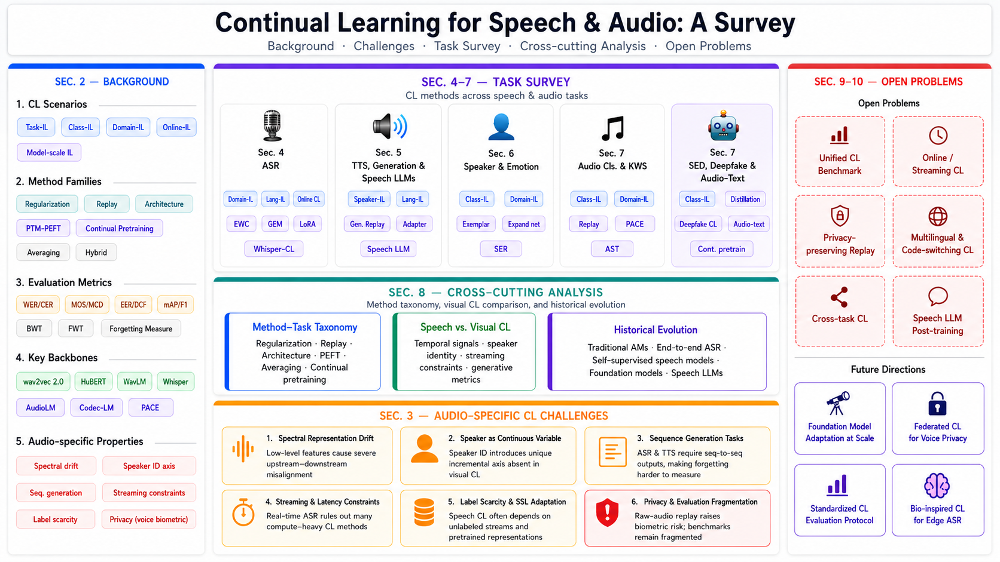

<div align="center">


  ## Awesome Speech and Audio Continual Learning

[](https://github.com/sindresorhus/awesome) [](../ieee_main.pdf) [](https://github.com/swagshaw/Awesome-Speech-and-Audio-Continual-Learning/)

<br>


</div>

> A curated paper list for continual learning in speech and audio, covering ASR, TTS, speaker-related tasks, audio classification, SED/SELD, deepfake detection, speech SSL, and speech LLMs. We welcome everyone to open an issue for any related work we haven’t discussed, and we’ll try to address it in the next release!

## News

- **[2026-04-25]** 🔥 We are excited to introduce a collection of papers on CL for speech and audio models!

## Citation

If you find this list helpful, please cite our work:

```bibtex
@article{speech_audio_cl_survey_2026,
  title={A Survey of Continual Learning in Speech and Audio},
  author={Yang Xiao},
  year={2026},
}
```

## Contents

- [📖 Overview](#overview)
- [📄 Paper List](#paper-list)
  - [Foundations, Surveys, and Benchmarks](#foundations-surveys-and-benchmarks)
  - [ASR: Domain, Acoustic Models, and End-to-End Learning](#asr-domain-acoustic-models-and-end-to-end-learning)
  - [ASR: Online, On-device, and Deployment-oriented Learning](#asr-online-on-device-and-deployment-oriented-learning)
  - [ASR: Multilingual, Whisper, and Language Extension](#asr-multilingual-whisper-and-language-extension)
  - [Speech SSL and Continual Pretraining](#speech-ssl-and-continual-pretraining)
  - [TTS and Generative Speech](#tts-and-generative-speech)
  - [Speech LLMs and Multimodal Speech Models](#speech-llms-and-multimodal-speech-models)
  - [Speaker-related Tasks and Speech Emotion Recognition](#speaker-related-tasks-and-speech-emotion-recognition)
  - [Keyword Spotting and Spoken Language Understanding](#keyword-spotting-and-spoken-language-understanding)
  - [Audio Classification and Acoustic Scenes](#audio-classification-and-acoustic-scenes)
  - [Sound Event Detection, Localization, and Bioacoustics](#sound-event-detection-localization-and-bioacoustics)
  - [Audio Deepfake Detection](#audio-deepfake-detection)
  - [Audio Captioning, Separation, Enhancement, and Audio-Text Learning](#audio-captioning-separation-enhancement-and-audio-text-learning)

## 📖 Overview

This list follows the taxonomy used in the survey:

1. **Settings:** domain-, class-, task-, online-, and model-scale continual learning.
2. **Method families:** regularization, replay, architecture-based methods, PEFT, averaging, continual pretraining, and multimodal post-training.
3. **Tasks:** speech recognition and synthesis, speaker-aware interfaces, environmental audio, event detection, deepfake detection, and speech-capable foundation models.

## 📄 Paper List

### Foundations, Surveys, and Benchmarks

| Year | Title | Venue | Paper | TLDR |
|:-:|:-|:-|:-:|:-|
| 2026 | Closing the Modality Reasoning Gap for Speech Large Language Models | arXiv | [](https://arxiv.org/abs/2601.05543) | It is relevant because it studies how speech LLMs maintain abilities while being adapted across modalities, which is a continual-learning problem of preserving text/speech abilities during cross-modal adaptation. |
| 2025 | Continual Learning for Acoustic Event Classification | arXiv | [](https://arxiv.org/abs/2512.17932) | It is relevant because the abstract formulates keyword spotting as a continual/incremental learning problem and studies distillation and replay or memory for preserving previous knowledge while the model is updated sequentially. |
| 2025 | Closing the Gap Between Text and Speech Understanding in LLMs | arXiv | [](https://arxiv.org/abs/2510.13632) | It is relevant because the abstract explicitly links speech-LLM adaptation to forgetting or capability degradation, i.e., preserving previous knowledge while the model is updated sequentially. |
| 2025 | Cross-Modal Knowledge Distillation for Speech Large Language Models | ICASSP | [](https://doi.org/10.1109/icassp55912.2026.11464272) | It is relevant because the abstract explicitly links speech-LLM adaptation to forgetting or capability degradation, i.e., preserving previous knowledge while the model is updated sequentially. |
| 2025 | Analyzing Mitigation Strategies for Catastrophic Forgetting in End-to-End Training of Spoken Language Models | INTERSPEECH | [](https://doi.org/10.21437/interspeech.2025-409) | It is relevant because the abstract explicitly links speech-LLM adaptation to forgetting or capability degradation, i.e., preserving previous knowledge while the model is updated sequentially. |
| 2025 | Few-Shot Keyword-incremental Learning Using Compositional Information | ICASSP | [](https://doi.org/10.1109/icassp49660.2025.10889790) | It is relevant because the abstract formulates keyword spotting as a continual/incremental learning problem and studies prototype/classifier updates for learning new classes without losing performance on earlier classes. |
| 2024 | Few-Shot Keyword-Incremental Learning with Total Calibration | INTERSPEECH | [](https://doi.org/10.21437/interspeech.2024-1823) | It is relevant because the abstract formulates keyword spotting as a continual/incremental learning problem and studies prototype/classifier updates for adding new keywords or words while preserving prior keyword knowledge. |
| 2024 | Towards Robust Audio Deepfake Detection: A Evolving Benchmark for Continual Learning | - | - | It is relevant because it provides a benchmark or evaluation setting for continual learning in audio deepfake detection, especially for preserving previous knowledge while the model is updated sequentially. |
| 2024 | Disentangled Prototype-Guided Dynamic Memory Replay for Continual Learning in Acoustic Signal Classification | IEEE Access | [](https://doi.org/10.1109/access.2024.3482105) | It is relevant because the abstract formulates audio tasks as a continual/incremental learning problem and studies replay or memory and prototype/classifier updates for preserving previous knowledge while the model is updated sequentially. |
| 2023 | CL-MASR: A Continual Learning Benchmark for Multilingual ASR | IEEE/ACM TASLP | [](https://doi.org/10.36227/techrxiv.24430876.v1) | It is relevant because it provides a benchmark or evaluation setting for continual learning in ASR, especially for extending to new languages while preserving prior language or task ability. |
| 2023 | M-CTRL: A Continual Representation Learning Framework with Slowly Improving Past Pre-Trained Model | ICASSP | [](https://doi.org/10.1109/icassp49357.2023.10096793) | It is relevant because the abstract formulates ASR as a continual/incremental learning problem and studies continued use of pretrained speech representations and online or resource-constrained learning for supporting sequential updates without treating each task as isolated. |
| 2023 | Mitigating Catastrophic Forgetting for Few-Shot Spoken Word Classification Through Meta-Learning | INTERSPEECH | [](https://doi.org/10.21437/interspeech.2023-385) | It is relevant because the abstract directly studies forgetting in speech/audio tasks, focusing on preserving previous knowledge while the model is updated sequentially. |
| 2023 | Continually Learning New Languages | arXiv | [](https://arxiv.org/abs/2211.11703) | It is relevant because the abstract targets forgetting in ASR and evaluates regularization and parameter averaging or factorization to support preserving previous knowledge while the model is updated sequentially. |
| 2022 | Towards Continually Learning New Languages | INTERSPEECH | [](https://doi.org/10.21437/interspeech.2023-1867) | It is relevant because the abstract targets forgetting in ASR and evaluates regularization and parameter averaging or factorization to support preserving previous knowledge while the model is updated sequentially. |
| 2022 | Privacy Preserving Synthetic Respiratory Sounds for Class Incremental Learning | Smart Health | [](https://doi.org/10.1016/j.smhl.2021.100232) | It is relevant because the abstract formulates audio tasks as a continual/incremental learning problem centered on learning new classes without losing performance on earlier classes. |
| 2021 | An Incremental Class-Learning Approach with Acoustic Novelty Detection for Acoustic Event Recognition | Sensors | [](https://doi.org/10.3390/s21196622) | It is relevant because the abstract targets forgetting in audio classification and evaluates replay or memory to support preserving previous knowledge while the model is updated sequentially. |
| 2019 | A Progressive Model to Enable Continual Learning for Semantic Slot Filling | EMNLP | [](https://doi.org/10.18653/v1/d19-1126) | It is relevant because the abstract formulates spoken language understanding as a continual/incremental learning problem centered on supporting sequential updates without treating each task as isolated. |
| 1993 | Catastrophic Forgetting in Neural Networks: The Role of Rehearsal Mechanisms | ANNES | [](https://doi.org/10.1109/annes.1993.323080) | It is relevant as a foundational study of catastrophic forgetting and rehearsal, which underpins later continual-learning work in speech and audio. |

### ASR: Domain, Acoustic Models, and End-to-End Learning

| Year | Title | Venue | Paper | TLDR |
|:-:|:-|:-|:-:|:-|
| 2026 | Continual Adaptation for Pacific Indigenous Speech Recognition | - | - | It is relevant because the abstract formulates ASR as a continual/incremental learning problem and studies parameter-efficient adaptation for preserving previous knowledge while the model is updated sequentially. |
| 2026 | Efficient Rehearsal for Continual Learning in ASR via Singular Value Tuning | IEEE/ACM TASLP | [](https://doi.org/10.1109/taslpro.2026.3658931) | It is relevant because the abstract formulates ASR as a continual/incremental learning problem and studies replay or memory and parameter-efficient adaptation for preserving previous knowledge while the model is updated sequentially. |
| 2026 | Inverse-Hessian Regularization for Continual Learning in ASR | ICASSP | [](https://doi.org/10.1109/icassp55912.2026.11461503) | It is relevant because the abstract formulates ASR as a continual/incremental learning problem and studies replay or memory and regularization for preserving previous knowledge while the model is updated sequentially. |
| 2025 | Continual Test-Time Dynamic Speech Recognition via Adaptive Threshold | CMLDS | [](https://doi.org/10.1117/12.3072469) | It is relevant because it studies adaptation in ASR under changing data or tasks, making adapting to new domains, accents, dialects, or low-resource conditions the central continual-learning concern. |
| 2025 | Weight Factorization and Centralization for Continual Learning in Speech Recognition | INTERSPEECH | [](https://doi.org/10.21437/interspeech.2025-1701) | It is relevant because the abstract formulates ASR as a continual/incremental learning problem and studies parameter-efficient adaptation and parameter averaging or factorization for preserving previous knowledge while the model is updated sequentially. |
| 2025 | Low-Resource Speech Recognition of Radiotelephony Communications Based on Continuous Learning of In-Domain and Out-of-Domain Knowledge | IEEE Signal Processing Letters | [](https://doi.org/10.1109/lsp.2025.3545955) | It is relevant because the abstract targets forgetting in ASR and evaluates distillation and continued use of pretrained speech representations to support preserving previous knowledge while the model is updated sequentially. |
| 2024 | Parameter Averaging Is All You Need To Prevent Forgetting | SLT | [](https://doi.org/10.1109/slt61566.2024.10832275) | It is relevant because the abstract formulates ASR as a continual/incremental learning problem and studies parameter-efficient adaptation and parameter averaging or factorization for preserving previous knowledge while the model is updated sequentially. |
| 2024 | Sequential Editing for Lifelong Training of Speech Recognition Models | INTERSPEECH | [](https://doi.org/10.21437/interspeech.2024-2027) | It is included based on the available title/metadata because it addresses sequential learning or adaptation in ASR, where continual learning is needed for supporting sequential updates without treating each task as isolated. |
| 2024 | Bayesian Parameter-Efficient Fine-Tuning for Overcoming Catastrophic Forgetting | IEEE/ACM TASLP | [](https://doi.org/10.1109/taslp.2024.3463395) | It is relevant because the abstract targets forgetting in ASR and evaluates parameter-efficient adaptation and continued use of pretrained speech representations to support preserving previous knowledge while the model is updated sequentially. |
| 2024 | Continuously Learning New Words in Automatic Speech Recognition | ICASSP | [](https://doi.org/10.1109/icassp49660.2025.10889216) | It is relevant because the abstract formulates ASR as a continual/incremental learning problem and studies replay or memory and continued use of pretrained speech representations for adding new keywords or words while preserving prior keyword knowledge. |
| 2023 | CLRL-Tuning: A Novel Continual Learning Approach for Automatic Speech Recognition | INTERSPEECH | [](https://doi.org/10.21437/interspeech.2023-503) | It is relevant because the abstract formulates ASR as a continual/incremental learning problem centered on supporting sequential updates without treating each task as isolated. |
| 2023 | Continual Learning for End-to-End ASR by Averaging Domain Experts | arXiv | [](https://arxiv.org/abs/2305.09681) | It is relevant because the abstract formulates ASR as a continual/incremental learning problem and studies parameter averaging or factorization for preserving previous knowledge while the model is updated sequentially. |
| 2023 | Residual Adapters for Targeted Updates in RNN-Transducer Based Speech Recognition System | SLT | [](https://doi.org/10.1109/slt54892.2023.10022622) | It is relevant because it studies adaptation in ASR under changing data or tasks, making adding new keywords or words while preserving prior keyword knowledge the central continual-learning concern. |
| 2023 | Domain Expansion for End-to-End Speech Recognition: Applications for Accent/Dialect Speech | IEEE/ACM TASLP | [](https://doi.org/10.1109/taslp.2022.3233238) | It is relevant because the abstract formulates ASR as a continual/incremental learning problem and studies replay or memory and regularization for preserving previous knowledge while the model is updated sequentially. |
| 2022 | Weight Averaging: A Simple Yet Effective Method to Overcome Catastrophic Forgetting in Automatic Speech Recognition | ICASSP | [](https://doi.org/10.1109/icassp49357.2023.10095147) | It is relevant because the abstract targets forgetting in ASR and evaluates distillation and parameter averaging or factorization to support preserving previous knowledge while the model is updated sequentially. |
| 2022 | Damage Control During Domain Adaptation for Transducer Based Automatic Speech Recognition | SLT | [](https://doi.org/10.1109/slt54892.2023.10023219) | It is relevant because the abstract targets forgetting in ASR and evaluates parameter-efficient adaptation to support preserving previous knowledge while the model is updated sequentially. |
| 2022 | Incremental Learning for RNN-Transducer Based Speech Recognition Models | INTERSPEECH | [](https://doi.org/10.21437/interspeech.2022-10795) | It is relevant because the abstract formulates ASR as a continual/incremental learning problem centered on supporting sequential updates without treating each task as isolated. |
| 2022 | Dealing with Unknowns in Continual Learning for End-to-end Automatic Speech Recognition | INTERSPEECH | [](https://doi.org/10.21437/interspeech.2022-11139) | It is relevant because the abstract formulates ASR as a continual/incremental learning problem centered on supporting sequential updates without treating each task as isolated. |
| 2022 | Updating Only Encoders Prevents Catastrophic Forgetting of End-to-End ASR Models | INTERSPEECH | [](https://doi.org/10.21437/interspeech.2022-11282) | It is relevant because the abstract directly studies forgetting in ASR, focusing on preserving previous knowledge while the model is updated sequentially. |
| 2022 | Using Adapters to Overcome Catastrophic Forgetting in End-to-End Automatic Speech Recognition | ICASSP | [](https://doi.org/10.1109/icassp49357.2023.10095837) | It is relevant because the abstract targets forgetting in ASR and evaluates parameter-efficient adaptation to support preserving previous knowledge while the model is updated sequentially. |
| 2021 | Continual Learning for Monolingual End-to-End Automatic Speech Recognition | EUSIPCO | [](https://doi.org/10.23919/eusipco55093.2022.9909589) | It is relevant because the abstract formulates ASR as a continual/incremental learning problem centered on preserving previous knowledge while the model is updated sequentially. |
| 2021 | Continual Learning Using Lattice-Free MMI for Speech Recognition | ICASSP | [](https://doi.org/10.1109/icassp43922.2022.9746260) | It is relevant because the abstract formulates ASR as a continual/incremental learning problem and studies regularization for preserving previous knowledge while the model is updated sequentially. |
| 2021 | Towards Lifelong Learning of End-to-end ASR | INTERSPEECH | [](https://doi.org/10.21437/interspeech.2021-563) | It is relevant because the abstract formulates ASR as a continual/incremental learning problem centered on preserving previous knowledge while the model is updated sequentially. |
| 2020 | Continual Learning for Multi-Dialect Acoustic Models | INTERSPEECH | [](https://doi.org/10.21437/interspeech.2020-1797) | It is relevant because the abstract formulates ASR as a continual/incremental learning problem centered on adapting to new domains, accents, dialects, or low-resource conditions. |
| 2020 | Continual Learning in Automatic Speech Recognition | INTERSPEECH | [](https://doi.org/10.21437/interspeech.2020-2962) | It is relevant because the abstract formulates ASR as a continual/incremental learning problem centered on supporting sequential updates without treating each task as isolated. |
| 2020 | Incremental Learning for End-to-End Automatic Speech Recognition | ASRU | [](https://doi.org/10.1109/asru51503.2021.9687910) | It is relevant because the abstract formulates ASR as a continual/incremental learning problem and studies distillation for preserving previous knowledge while the model is updated sequentially. |
| 2019 | Domain Expansion in DNN-Based Acoustic Models for Robust Speech Recognition | ASRU | [](https://doi.org/10.1109/asru46091.2019.9003769) | It is relevant because the abstract targets forgetting in ASR and evaluates regularization to support preserving previous knowledge while the model is updated sequentially. |
| 2019 | A Multi-Task Learning Framework for Overcoming the Catastrophic Forgetting in Automatic Speech Recognition | arXiv | [](https://arxiv.org/abs/1904.08039) | It is relevant because the abstract formulates ASR as a continual/incremental learning problem centered on preserving previous knowledge while the model is updated sequentially. |

### ASR: Online, On-device, and Deployment-oriented Learning

| Year | Title | Venue | Paper | TLDR |
|:-:|:-|:-|:-:|:-|
| 2024 | Unsupervised Online Continual Learning for Automatic Speech Recognition | INTERSPEECH | [](https://doi.org/10.21437/interspeech.2024-136) | It is relevant because the abstract formulates ASR as a continual/incremental learning problem and studies online or resource-constrained learning for supporting sequential updates without treating each task as isolated. |
| 2023 | Rehearsal-Free Online Continual Learning for Automatic Speech Recognition | INTERSPEECH | [](https://doi.org/10.21437/interspeech.2023-788) | It is relevant because the abstract formulates ASR as a continual/incremental learning problem and studies online or resource-constrained learning for supporting sequential updates without treating each task as isolated. |
| 2022 | Continual Learning for On-Device Speech Recognition Using Disentangled Conformers | ICASSP | [](https://doi.org/10.1109/icassp49357.2023.10095484) | It is relevant because the abstract formulates ASR as a continual/incremental learning problem and studies online or resource-constrained learning for adapting to new domains, accents, dialects, or low-resource conditions. |
| 2022 | Online Continual Learning of End-to-End Speech Recognition Models | INTERSPEECH | [](https://doi.org/10.21437/interspeech.2022-11093) | It is relevant because the abstract formulates ASR as a continual/incremental learning problem and studies replay or memory and regularization for supporting sequential updates without treating each task as isolated. |

### ASR: Multilingual, Whisper, and Language Extension

| Year | Title | Venue | Paper | TLDR |
|:-:|:-|:-|:-:|:-|
| 2025 | Continual Learning with Embedding Layer Surgery and Task-wise Beam Search Using Whisper | SLT | [](https://doi.org/10.1109/slt61566.2024.10832213) | It is relevant because the abstract formulates ASR as a continual/incremental learning problem and studies replay or memory and parameter-efficient adaptation for preserving previous knowledge while the model is updated sequentially. |
| 2024 | Continual Learning With Embedding Layer Surgery and Task-Wise Beam Search Using Whisper | SLT | [](https://doi.org/10.1109/slt61566.2024.10832213) | It is relevant because the abstract formulates ASR as a continual/incremental learning problem and studies replay or memory and parameter-efficient adaptation for preserving previous knowledge while the model is updated sequentially. |
| 2024 | Towards Rehearsal-Free Multilingual ASR: A LoRA-based Case Study on Whisper | INTERSPEECH | [](https://doi.org/10.21437/interspeech.2024-1953) | It is relevant because it studies adaptation of pretrained speech/audio models for ASR, where the continual-learning issue is extending to new languages while preserving prior language or task ability. |
| 2024 | Continual Learning Optimizations for Auto-regressive Decoder of Multilingual ASR Systems | INTERSPEECH | [](https://doi.org/10.21437/interspeech.2024-205) | It is relevant because the abstract formulates ASR as a continual/incremental learning problem centered on extending to new languages while preserving prior language or task ability. |
| 2024 | A Parameter-efficient Language Extension Framework for Multilingual ASR | INTERSPEECH | [](https://doi.org/10.21437/interspeech.2024-1745) | It is included based on the available title/metadata because it addresses sequential learning or adaptation in ASR, where continual learning is needed for extending to new languages while preserving prior language or task ability. |

### Speech SSL and Continual Pretraining

| Year | Title | Venue | Paper | TLDR |
|:-:|:-|:-|:-:|:-|
| 2025 | SONAR: Self-Distilled Continual Pre-training for Domain Adaptive Audio Representation | ICASSP | [](https://doi.org/10.1109/icassp55912.2026.11465067) | It is relevant because the abstract formulates audio tasks as a continual/incremental learning problem and studies regularization and continued use of pretrained speech representations for preserving previous knowledge while the model is updated sequentially. |
| 2024 | What Happens in Continued Pre-Training? Analysis of Self-Supervised Speech Models with Continued Pre-Training for Colloquial Finnish ASR | INTERSPEECH | [](https://doi.org/10.21437/interspeech.2024-476) | It is relevant because the abstract formulates ASR as a continual/incremental learning problem and studies continued use of pretrained speech representations for adapting to new domains, accents, dialects, or low-resource conditions. |
| 2024 | Less Forgetting for Better Generalization: Exploring Continual-learning Fine-tuning Methods for Speech Self-supervised Representations | arXiv | [](https://arxiv.org/abs/2407.00756) | It is relevant because the abstract targets forgetting in ASR and evaluates continued use of pretrained speech representations to support preserving previous knowledge while the model is updated sequentially. |
| 2024 | Multi-Modal Continual Pre-Training For Audio Encoders | ICASSP | [](https://doi.org/10.1109/icassp48485.2024.10446424) | It is relevant because the abstract formulates audio-text learning as a continual/incremental learning problem and studies continued use of pretrained speech representations for preserving text/speech abilities during cross-modal adaptation. |
| 2024 | SOA: Reducing Domain Mismatch in SSL Pipeline by Speech Only Adaptation for Low Resource ASR | ICASSPW | [](https://doi.org/10.1109/icasspw62465.2024.10625884) | It is relevant because it studies adaptation of pretrained speech/audio models for ASR, where the continual-learning issue is adapting to new domains, accents, dialects, or low-resource conditions. |
| 2023 | FusDom: Combining in-Domain and Out-of-Domain Knowledge for Continuous Self-Supervised Learning | ICASSP | [](https://doi.org/10.1109/icassp48485.2024.10448147) | It is relevant because the abstract formulates ASR as a continual/incremental learning problem and studies distillation and continued use of pretrained speech representations for preserving previous knowledge while the model is updated sequentially. |
| 2023 | Stable Distillation: Regularizing Continued Pre-Training for Low-Resource Automatic Speech Recognition | ICASSP | [](https://doi.org/10.1109/icassp48485.2024.10446335) | It is relevant because the abstract formulates ASR as a continual/incremental learning problem and studies distillation and regularization for adapting to new domains, accents, dialects, or low-resource conditions. |
| 2022 | CTRL: Continual Representation Learning to Transfer Information of Pre-trained for WAV2VEC 2.0 | INTERSPEECH | [](https://doi.org/10.21437/interspeech.2022-10063) | It is relevant because it studies adaptation of pretrained speech/audio models for speech/audio tasks, where the continual-learning issue is supporting sequential updates without treating each task as isolated. |
| 2021 | An Adapter Based Pre-Training for Efficient and Scalable Self-Supervised Speech Representation Learning | ICASSP | [](https://doi.org/10.1109/icassp43922.2022.9747374) | It is relevant because the abstract targets forgetting in ASR and evaluates parameter-efficient adaptation and continued use of pretrained speech representations to support preserving previous knowledge while the model is updated sequentially. |
| 2021 | Continual-Wav2vec2: An Application of Continual Learning for Self-Supervised Automatic Speech Recognition | arXiv | [](https://arxiv.org/abs/2107.13530) | It is relevant because the abstract formulates ASR as a continual/incremental learning problem and studies parameter-efficient adaptation and continued use of pretrained speech representations for preserving previous knowledge while the model is updated sequentially. |

### TTS and Generative Speech

| Year | Title | Venue | Paper | TLDR |
|:-:|:-|:-|:-:|:-|
| 2025 | F5-TTS-RO: Extending F5-TTS to Romanian TTS via Lightweight Input Adaptation | arXiv | [](https://arxiv.org/abs/2512.12297) | It is relevant because it studies adaptation in TTS under changing data or tasks, making adapting to new domains, accents, dialects, or low-resource conditions the central continual-learning concern. |
| 2025 | Parameter-Efficient Fine-Tuning for Low-Resource Text-to-Speech via Cross-Lingual Continual Learning | INTERSPEECH | [](https://doi.org/10.21437/interspeech.2025-1344) | It is relevant because the abstract formulates TTS as a continual/incremental learning problem and studies parameter-efficient adaptation for extending to new languages while preserving prior language or task ability. |
| 2025 | Unseen Speaker and Language Adaptation for Lightweight Text-to-Speech with Adapters | MLSP | [](https://doi.org/10.1109/mlsp62443.2025.11204217) | It is relevant because the abstract targets forgetting in TTS and evaluates parameter-efficient adaptation to support preserving previous knowledge while the model is updated sequentially. |
| 2024 | Continual Gated Adapter for Bilingual Codec Text-to-Speech | O-COCOSDA | [](https://doi.org/10.1109/o-cocosda64382.2024.10800072) | It is relevant because the abstract formulates TTS as a continual/incremental learning problem and studies replay or memory and parameter-efficient adaptation for preserving previous knowledge while the model is updated sequentially. |
| 2024 | Continual Learning in Machine Speech Chain Using Gradient Episodic Memory | O-COCOSDA | [](https://doi.org/10.1109/o-cocosda64382.2024.10800352) | It is relevant because the abstract formulates ASR as a continual/incremental learning problem and studies replay or memory and regularization for preserving previous knowledge while the model is updated sequentially. |
| 2022 | Adapter-Based Extension of Multi-Speaker Text-to-Speech Model for New Speakers | INTERSPEECH | [](https://doi.org/10.21437/interspeech.2023-2313) | It is relevant because it studies adaptation in TTS under changing data or tasks, making adapting to new speakers without degrading prior speaker or voice knowledge the central continual-learning concern. |
| 2022 | Adversarial and Sequential Training for Cross-lingual Prosody Transfer TTS | INTERSPEECH | [](https://doi.org/10.21437/interspeech.2022-865) | It is included based on the available title/metadata because it addresses sequential learning or adaptation in TTS, where continual learning is needed for extending to new languages while preserving prior language or task ability. |
| 2021 | Towards Lifelong Learning of Multilingual Text-to-Speech Synthesis | ICASSP | [](https://doi.org/10.1109/icassp43922.2022.9746968) | It is relevant because the abstract formulates TTS as a continual/incremental learning problem and studies replay or memory and regularization for preserving previous knowledge while the model is updated sequentially. |
| 2021 | FedSpeech: Federated Text-to-Speech with Continual Learning | IJCAI | [](https://doi.org/10.24963/ijcai.2021/527) | It is relevant because the abstract formulates TTS as a continual/incremental learning problem centered on preserving previous knowledge while the model is updated sequentially. |
| 2021 | Continual Speaker Adaptation for Text-to-Speech Synthesis | arXiv | [](https://arxiv.org/abs/2103.14512) | It is relevant because the abstract formulates TTS as a continual/incremental learning problem and studies replay or memory and regularization for preserving previous knowledge while the model is updated sequentially. |

### Speech LLMs and Multimodal Speech Models

| Year | Title | Venue | Paper | TLDR |
|:-:|:-|:-|:-:|:-|
| 2025 | Understanding Textual Capability Degradation in Speech LLMs via Parameter Importance Analysis | ICASSP | [](https://doi.org/10.1109/icassp55912.2026.11461684) | It is relevant because the abstract explicitly links speech-LLM adaptation to forgetting or capability degradation, i.e., supporting sequential updates without treating each task as isolated. |
| 2025 | Balancing Speech Understanding and Generation Using Continual Pre-training for Codec-based Speech LLM | - | - | It is relevant because it studies how speech LLMs maintain abilities while being adapted across modalities, which is a continual-learning problem of preserving text/speech abilities during cross-modal adaptation. |

### Speaker-related Tasks and Speech Emotion Recognition

| Year | Title | Venue | Paper | TLDR |
|:-:|:-|:-|:-:|:-|
| 2024 | SeQuiFi: Mitigating Catastrophic Forgetting in Speech Emotion Recognition with Sequential Class-Finetuning | arXiv | [](https://arxiv.org/abs/2410.12567) | It is relevant because the abstract formulates speaker-related speech tasks as a continual/incremental learning problem and studies replay or memory and regularization for preserving previous knowledge while the model is updated sequentially. |
| 2023 | Continual Self-Supervised Domain Adaptation for End-to-End Speaker Diarization | SLT | [](https://doi.org/10.1109/slt54892.2023.10023195) | It is relevant because it studies adaptation of pretrained speech/audio models for speaker-related speech tasks, where the continual-learning issue is adapting to new domains, accents, dialects, or low-resource conditions. |
| 2022 | Dynamic Recognition of Speakers for Consent Management by Contrastive Embedding Replay | IEEE TNNLS | [](https://doi.org/10.1109/tnnls.2023.3317493) | It is relevant because the abstract addresses sequential model updates in speaker-related speech tasks, with continual learning needed for supporting sequential updates without treating each task as isolated. |
| 2021 | Internet of Emotional People: Towards Continual Affective Computing Cross Cultures via Audiovisual Signals | Future Generation Computer Systems | [](https://doi.org/10.1016/j.future.2020.08.002) | It is included based on the available title/metadata because it addresses sequential learning or adaptation in speaker-related speech tasks, where continual learning is needed for supporting sequential updates without treating each task as isolated. |
| 2021 | Efficient Continual Learning for Keyword Spotting and Speaker Identification | - | - | It is relevant because the abstract formulates keyword spotting as a continual/incremental learning problem centered on supporting sequential updates without treating each task as isolated. |
| 2010 | A GMM-Based Robust Incremental Adaptation with a Forgetting Factor for Speaker Verification | ICIC | [](https://doi.org/10.1007/978-3-642-14932-0_24) | It is relevant because the abstract directly studies forgetting in speaker-related speech tasks, focusing on preserving previous knowledge while the model is updated sequentially. |

### Keyword Spotting and Spoken Language Understanding

| Year | Title | Venue | Paper | TLDR |
|:-:|:-|:-|:-:|:-|
| 2025 | AnalyticKWS: Towards Exemplar-Free Analytic Class Incremental Learning for Small-footprint Keyword Spotting | ACL Findings | [](https://doi.org/10.18653/v1/2025.findings-acl.728) | It is relevant because the abstract formulates keyword spotting as a continual/incremental learning problem and studies replay or memory for preserving previous knowledge while the model is updated sequentially. |
| 2024 | Dark Experience for Incremental Keyword Spotting | ICASSP | [](https://doi.org/10.1109/icassp49660.2025.10890228) | It is relevant because the abstract formulates keyword spotting as a continual/incremental learning problem and studies distillation and replay or memory for preserving previous knowledge while the model is updated sequentially. |
| 2023 | Continual Contrastive Spoken Language Understanding | ACL Findings | [](https://doi.org/10.18653/v1/2024.findings-acl.223) | It is relevant because the abstract formulates keyword spotting as a continual/incremental learning problem and studies distillation and replay or memory for preserving previous knowledge while the model is updated sequentially. |
| 2023 | Dual-Memory Multi-Modal Learning for Continual Spoken Keyword Spotting with Confidence Selection and Diversity Enhancement | INTERSPEECH | [](https://doi.org/10.21437/interspeech.2023-613) | It is included based on the available title/metadata because it addresses sequential learning or adaptation in keyword spotting, where continual learning is needed for supporting sequential updates without treating each task as isolated. |
| 2023 | Online Continual Learning in Keyword Spotting for Low-Resource Devices via Pooling High-Order Temporal Statistics | INTERSPEECH | [](https://doi.org/10.21437/interspeech.2023-90) | It is relevant because the abstract formulates keyword spotting as a continual/incremental learning problem and studies online or resource-constrained learning for adapting to new domains, accents, dialects, or low-resource conditions. |
| 2023 | Sequence-Level Knowledge Distillation for Class-Incremental End-to-End Spoken Language Understanding | INTERSPEECH | [](https://doi.org/10.21437/interspeech.2023-242) | It is relevant because the abstract formulates keyword spotting as a continual/incremental learning problem and studies distillation for learning new classes without losing performance on earlier classes. |
| 2023 | Conditional Online Learning for Keyword Spotting | arXiv | [](https://arxiv.org/abs/2305.13332) | It is relevant because the abstract formulates keyword spotting as a continual/incremental learning problem and studies online or resource-constrained learning for preserving previous knowledge while the model is updated sequentially. |
| 2022 | An Investigation of the Combination of Rehearsal and Knowledge Distillation in Continual Learning for Spoken Language Understanding | INTERSPEECH | [](https://doi.org/10.21437/interspeech.2023-198) | It is relevant because the abstract formulates keyword spotting as a continual/incremental learning problem and studies distillation and replay or memory for preserving previous knowledge while the model is updated sequentially. |
| 2022 | Rainbow Keywords: Efficient Incremental Learning for Online Spoken Keyword Spotting | INTERSPEECH | [](https://doi.org/10.21437/interspeech.2022-10500) | It is relevant because the abstract formulates keyword spotting as a continual/incremental learning problem and studies distillation and replay or memory for preserving previous knowledge while the model is updated sequentially. |
| 2022 | Progressive Continual Learning for Spoken Keyword Spotting | ICASSP | [](https://doi.org/10.1109/icassp43922.2022.9746488) | It is relevant because the abstract formulates keyword spotting as a continual/incremental learning problem centered on preserving previous knowledge while the model is updated sequentially. |
| 2022 | Exploring the Joint Use of Rehearsal and Knowledge Distillation in Continual Learning for Spoken Language Understanding | arXiv | [](https://arxiv.org/abs/2211.08161) | It is relevant because the abstract formulates keyword spotting as a continual/incremental learning problem and studies distillation and replay or memory for preserving previous knowledge while the model is updated sequentially. |
| 2020 | Two-Stage Textual Knowledge Distillation for End-to-End Spoken Language Understanding | ICASSP | [](https://doi.org/10.1109/icassp39728.2021.9414619) | It is relevant because it studies adaptation of pretrained speech/audio models for ASR, where the continual-learning issue is adapting to new domains, accents, dialects, or low-resource conditions. |

### Audio Classification and Acoustic Scenes

| Year | Title | Venue | Paper | TLDR |
|:-:|:-|:-|:-:|:-|
| 2025 | Online Incremental Learning for Audio Classification Using a Pretrained Audio Model | WASPAA | [](https://doi.org/10.1109/waspaa66052.2025.11230989) | It is relevant because the abstract formulates audio classification as a continual/incremental learning problem and studies prototype/classifier updates and online or resource-constrained learning for preserving previous knowledge while the model is updated sequentially. |
| 2025 | Max-Informative Unlabeled Sample Replay for Semi-Supervised Class-Incremental Learning in Audio Classification | JCC | [](https://doi.org/10.1109/jcc67032.2025.00019) | It is relevant because the abstract formulates audio classification as a continual/incremental learning problem and studies replay or memory and regularization for preserving previous knowledge while the model is updated sequentially. |
| 2025 | A Closer Look at Class-Incremental Learning for Multi-Label Audio Classification | IEEE/ACM TASLP | [](https://doi.org/10.1109/taslpro.2025.3547233) | It is relevant because the abstract formulates audio classification as a continual/incremental learning problem and studies prototype/classifier updates for preserving previous knowledge while the model is updated sequentially. |
| 2025 | Few-Shot Class-Incremental Audio Classification Using Pseudo-Incrementally Trained Embedding Learner and Continually Updated Stochastic Classifier | IEEE/ACM TASLP | [](https://doi.org/10.1109/taslpro.2025.3610050) | It is relevant because the abstract formulates audio classification as a continual/incremental learning problem and studies prototype/classifier updates for learning new classes without losing performance on earlier classes. |
| 2024 | Domain-Incremental Learning for Audio Classification | ICASSP | [](https://doi.org/10.1109/icassp49660.2025.10890481) | It is relevant because the abstract formulates audio classification as a continual/incremental learning problem and studies parameter-efficient adaptation for preserving previous knowledge while the model is updated sequentially. |
| 2024 | Advancing Continual Learning for Robust Deepfake Audio Classification | TENCON | [](https://doi.org/10.1109/tencon61640.2024.10902761) | It is relevant because the abstract formulates audio deepfake detection as a continual/incremental learning problem and studies distillation and replay or memory for preserving previous knowledge while the model is updated sequentially. |
| 2024 | Online Domain-Incremental Learning Approach to Classify Acoustic Scenes in All Locations | EUSIPCO | [](https://doi.org/10.23919/eusipco63174.2024.10715156) | It is relevant because the abstract formulates audio classification as a continual/incremental learning problem and studies online or resource-constrained learning for preserving previous knowledge while the model is updated sequentially. |
| 2024 | Fully Few-shot Class-incremental Audio Classification Using Expandable Dual-embedding Extractor | INTERSPEECH | [](https://doi.org/10.21437/interspeech.2024-1758) | It is relevant because the abstract formulates audio classification as a continual/incremental learning problem centered on learning new classes without losing performance on earlier classes. |
| 2024 | Improving Continual Learning of Acoustic Scene Classification via Mutual Information Optimization | ICASSP | [](https://doi.org/10.1109/icassp48485.2024.10446846) | It is relevant because the abstract formulates audio classification as a continual/incremental learning problem and studies replay or memory for preserving previous knowledge while the model is updated sequentially. |
| 2024 | Class-Incremental Learning for Multi-Label Audio Classification | ICASSP | [](https://doi.org/10.1109/icassp48485.2024.10447952) | It is relevant because the abstract formulates audio classification as a continual/incremental learning problem and studies distillation for learning new classes without losing performance on earlier classes. |
| 2024 | Few-Shot Class-Incremental Audio Classification With Adaptive Mitigation of Forgetting and Overfitting | IEEE/ACM TASLP | [](https://doi.org/10.1109/taslp.2024.3385287) | It is relevant because the abstract formulates audio classification as a continual/incremental learning problem and studies prototype/classifier updates for preserving previous knowledge while the model is updated sequentially. |
| 2024 | Deep Generative Replay With Denoising Diffusion Probabilistic Models for Continual Learning in Audio Classification | IEEE Access | [](https://doi.org/10.1109/access.2024.3459954) | It is relevant because the abstract formulates ASR as a continual/incremental learning problem and studies replay or memory and prototype/classifier updates for preserving previous knowledge while the model is updated sequentially. |
| 2023 | Online Continual Learning in Acoustic Scene Classification: An Empirical Study | Sensors | [](https://doi.org/10.3390/s23156893) | It is relevant because the abstract formulates sound event detection/localization as a continual/incremental learning problem and studies replay or memory and regularization for preserving previous knowledge while the model is updated sequentially. |
| 2023 | Few-Shot Class-incremental Audio Classification Using Stochastic Classifier | INTERSPEECH | [](https://doi.org/10.21437/interspeech.2023-1610) | It is relevant because the abstract formulates audio classification as a continual/incremental learning problem and studies prototype/classifier updates for learning new classes without losing performance on earlier classes. |
| 2023 | Few-Shot Class-Incremental Audio Classification Using Dynamically Expanded Classifier With Self-Attention Modified Prototypes | IEEE Transactions on Multimedia | [](https://doi.org/10.1109/tmm.2023.3280011) | It is relevant because the abstract formulates audio classification as a continual/incremental learning problem and studies replay or memory and prototype/classifier updates for preserving previous knowledge while the model is updated sequentially. |
| 2023 | Few-Shot Class-incremental Audio Classification Using Adaptively-refined Prototypes | INTERSPEECH | [](https://doi.org/10.21437/interspeech.2023-1380) | It is relevant because the abstract formulates audio classification as a continual/incremental learning problem and studies prototype/classifier updates for learning new classes without losing performance on earlier classes. |
| 2023 | Few-Shot Class-Incremental Audio Classification via Discriminative Prototype Learning | Expert Systems with Applications | [](https://doi.org/10.1016/j.eswa.2023.120044) | It is relevant because the abstract formulates audio classification as a continual/incremental learning problem and studies prototype/classifier updates for learning new classes without losing performance on earlier classes. |
| 2023 | Adapter Incremental Continual Learning of Efficient Audio Spectrogram Transformers | INTERSPEECH | [](https://doi.org/10.21437/interspeech.2023-1189) | It is relevant because the abstract formulates audio classification as a continual/incremental learning problem and studies parameter-efficient adaptation for supporting sequential updates without treating each task as isolated. |
| 2023 | Incremental Learning of Acoustic Scenes and Sound Events | arXiv | [](https://arxiv.org/abs/2302.14815) | It is relevant because the abstract formulates sound event detection/localization as a continual/incremental learning problem and studies distillation for supporting sequential updates without treating each task as isolated. |
| 2023 | Episodic Memory Based Continual Learning Without Catastrophic Forgetting for Environmental Sound Classification | Journal of Ambient Intelligence and Humanized Computing | [](https://doi.org/10.1007/s12652-023-04561-5) | It is relevant because the abstract formulates audio classification as a continual/incremental learning problem and studies replay or memory for preserving previous knowledge while the model is updated sequentially. |
| 2022 | Task Incremental Learning With Static Memory for Audio Classification Without Catastrophic Interference | IEEE Consumer Electronics Magazine | [](https://doi.org/10.1109/mce.2022.3145724) | It is relevant because the abstract formulates audio classification as a continual/incremental learning problem and studies replay or memory for preserving previous knowledge while the model is updated sequentially. |
| 2022 | Learning Representations for New Sound Classes With Continual Self-Supervised Learning | IEEE Signal Processing Letters | [](https://doi.org/10.1109/lsp.2022.3229643) | It is relevant because the abstract formulates audio classification as a continual/incremental learning problem and studies distillation and continued use of pretrained speech representations for preserving previous knowledge while the model is updated sequentially. |
| 2021 | Few-Shot Continual Learning for Audio Classification | ICASSP | [](https://doi.org/10.1109/icassp39728.2021.9413584) | It is relevant because the abstract formulates audio classification as a continual/incremental learning problem and studies prototype/classifier updates for supporting sequential updates without treating each task as isolated. |
| 2019 | Continual Learning of New Sound Classes Using Generative Replay | WASPAA | [](https://doi.org/10.1109/waspaa.2019.8937236) | It is relevant because the abstract formulates audio classification as a continual/incremental learning problem and studies replay or memory and prototype/classifier updates for preserving previous knowledge while the model is updated sequentially. |

### Sound Event Detection, Localization, and Bioacoustics

| Year | Title | Venue | Paper | TLDR |
|:-:|:-|:-|:-:|:-|
| 2025 | Learning Order Matters in Class-Incremental Learning for Sound Localization and Detection | EUSIPCO | [](https://doi.org/10.23919/eusipco63237.2025.11226063) | It is relevant because the abstract formulates sound event detection/localization as a continual/incremental learning problem centered on learning new classes without losing performance on earlier classes. |
| 2024 | Class-Incremental Learning for Sound Event Localization and Detection | ICASSPW | [](https://doi.org/10.1109/icasspw65056.2025.11011278) | It is relevant because the abstract formulates sound event detection/localization as a continual/incremental learning problem and studies distillation for learning new classes without losing performance on earlier classes. |
| 2024 | UCIL: An Unsupervised Class Incremental Learning Approach for Sound Event Detection | ICASSP | [](https://doi.org/10.1109/icassp49660.2025.10887631) | It is relevant because the abstract formulates sound event detection/localization as a continual/incremental learning problem and studies distillation for learning new classes without losing performance on earlier classes. |
| 2024 | Where’s That Voice Coming? Continual Learning for Sound Source Localization | ICME | [](https://doi.org/10.1109/icme59968.2025.11209062) | It is relevant because the abstract formulates sound event detection/localization as a continual/incremental learning problem centered on preserving previous knowledge while the model is updated sequentially. |
| 2024 | Double Mixture: Towards Continual Event Detection from Speech | arXiv | [](https://arxiv.org/abs/2404.13289) | It is relevant because the abstract formulates ASR as a continual/incremental learning problem and studies replay or memory for preserving previous knowledge while the model is updated sequentially. |
| 2023 | FEW-Shot Continual Learning with Weight Alignment and Positive Enhancement for Bioacoustic Event Detection | ICASSP | [](https://doi.org/10.1109/icassp49357.2023.10096307) | It is relevant because the abstract formulates sound event detection/localization as a continual/incremental learning problem centered on supporting sequential updates without treating each task as isolated. |

### Audio Deepfake Detection

| Year | Title | Venue | Paper | TLDR |
|:-:|:-|:-|:-:|:-|
| 2025 | Continual Audio Deepfake Detection via Universal Adversarial Perturbation | APSIPA ASC | [](https://doi.org/10.1109/apsipaasc65261.2025.11249335) | It is relevant because the abstract formulates TTS as a continual/incremental learning problem and studies continued use of pretrained speech representations for preserving previous knowledge while the model is updated sequentially. |
| 2025 | Rehearsal with Auxiliary-Informed Sampling for Audio Deepfake Detection | INTERSPEECH | [](https://doi.org/10.21437/interspeech.2025-2298) | It is relevant because the abstract formulates audio deepfake detection as a continual/incremental learning problem and studies replay or memory for preserving previous knowledge while the model is updated sequentially. |
| 2025 | Listen, Analyze, and Adapt to Learn New Attacks: An Exemplar-Free Class Incremental Learning Method for Audio Deepfake Source Tracing | INTERSPEECH | [](https://doi.org/10.21437/interspeech.2025-16) | It is relevant because the abstract formulates audio deepfake detection as a continual/incremental learning problem centered on learning new classes without losing performance on earlier classes. |
| 2025 | Continual Unsupervised Domain Adaptation for Audio Deepfake Detection | ICASSP | [](https://doi.org/10.1109/icassp49660.2025.10890538) | It is relevant because the abstract formulates audio deepfake detection as a continual/incremental learning problem and studies distillation and replay or memory for preserving previous knowledge while the model is updated sequentially. |
| 2025 | What Affects the Performance of Fake Audio Detection? Analyzing Factors in a Continual Learning Setting | ICASSP | [](https://doi.org/10.1109/icassp49660.2025.10888114) | It is relevant because the abstract formulates speaker-related speech tasks as a continual/incremental learning problem and studies replay or memory for preserving previous knowledge while the model is updated sequentially. |
| 2024 | Region-Based Optimization in Continual Learning for Audio Deepfake Detection | AAAI | [](https://doi.org/10.1609/aaai.v39i22.34535) | It is relevant because the abstract formulates TTS as a continual/incremental learning problem and studies replay or memory for preserving previous knowledge while the model is updated sequentially. |
| 2024 | Freeze and Learn: Continual Learning with Selective Freezing for Speech Deepfake Detection | ICASSP | [](https://doi.org/10.1109/icassp49660.2025.10889357) | It is relevant because the abstract formulates audio deepfake detection as a continual/incremental learning problem and studies parameter-efficient adaptation for adapting to newly emerging spoofing or deepfake attacks. |
| 2023 | What to Remember: Self-Adaptive Continual Learning for Audio Deepfake Detection | AAAI | [](https://doi.org/10.1609/aaai.v38i17.29929) | It is relevant because the abstract formulates TTS as a continual/incremental learning problem centered on preserving previous knowledge while the model is updated sequentially. |
| 2023 | Do You Remember? Overcoming Catastrophic Forgetting for Fake Audio Detection | ICML | - | It is relevant because the abstract formulates speech emotion recognition as a continual/incremental learning problem and studies regularization for preserving previous knowledge while the model is updated sequentially. |
| 2023 | Adaptive Fake Audio Detection with Low-Rank Model Squeezing | arXiv | [](https://arxiv.org/abs/2306.04956) | It is relevant because it studies adaptation in audio deepfake detection under changing data or tasks, making supporting sequential updates without treating each task as isolated the central continual-learning concern. |
| 2021 | Continual Learning for Fake Audio Detection | INTERSPEECH | [](https://doi.org/10.21437/interspeech.2021-794) | It is relevant because the abstract formulates speaker-related speech tasks as a continual/incremental learning problem and studies distillation and replay or memory for preserving previous knowledge while the model is updated sequentially. |

### Audio Captioning, Separation, Enhancement, and Audio-Text Learning

| Year | Title | Venue | Paper | TLDR |
|:-:|:-|:-|:-:|:-|
| 2026 | CORD: Bridging the Audio-Text Reasoning Gap via Weighted On-policy Cross-modal Distillation | arXiv | [](https://arxiv.org/abs/2601.16547) | It is relevant because the abstract explicitly links speech-LLM adaptation to forgetting or capability degradation, i.e., preserving text/speech abilities during cross-modal adaptation. |
| 2025 | TAIL: Text-Audio Incremental Learning | arXiv | [](https://arxiv.org/abs/2503.04258) | It is relevant because the abstract formulates audio-text learning as a continual/incremental learning problem and studies distillation for preserving previous knowledge while the model is updated sequentially. |
| 2024 | Continual Audio-Visual Sound Separation | NeurIPS | [](https://doi.org/10.52202/079017-2421) | It is included based on the available title/metadata because it addresses sequential learning or adaptation in sound separation, where continual learning is needed for supporting sequential updates without treating each task as isolated. |
| 2024 | Lifelong Learning MOS Prediction for Synthetic Speech Quality Evaluation | INTERSPEECH | [](https://doi.org/10.21437/interspeech.2024-959) | It is relevant because the abstract formulates speech tasks as a continual/incremental learning problem centered on supporting sequential updates without treating each task as isolated. |
| 2024 | Learning Noise Adapters for Incremental Speech Enhancement | IEEE Signal Processing Letters | [](https://doi.org/10.1109/lsp.2024.3482171) | It is relevant because the abstract targets forgetting in speech enhancement and evaluates parameter-efficient adaptation and regularization to support preserving previous knowledge while the model is updated sequentially. |
| 2023 | Universal Sound Separation Using Replay-based Data Sampling in Incremental Learning | APSIPA ASC | [](https://doi.org/10.1109/apsipaasc58517.2023.10317582) | It is relevant because the abstract formulates sound separation as a continual/incremental learning problem and studies replay or memory and regularization for preserving previous knowledge while the model is updated sequentially. |
| 2023 | DeCoR: Defy Knowledge Forgetting by Predicting Earlier Audio Codes | INTERSPEECH | [](https://doi.org/10.21437/interspeech.2023-2297) | It is relevant because the abstract formulates audio classification as a continual/incremental learning problem and studies continued use of pretrained speech representations for preserving previous knowledge while the model is updated sequentially. |
| 2021 | Continual Self-Training With Bootstrapped Remixing For Speech Enhancement | ICASSP | [](https://doi.org/10.1109/icassp43922.2022.9747463) | It is relevant because it studies adaptation of pretrained speech/audio models for sound separation, where the continual-learning issue is adapting to new domains, accents, dialects, or low-resource conditions. |
| 2021 | Continual Learning for Automated Audio Captioning Using The Learning Without Forgetting Approach | arXiv | [](https://arxiv.org/abs/2107.08028) | It is relevant because the abstract formulates audio captioning as a continual/incremental learning problem centered on preserving previous knowledge while the model is updated sequentially. |
| 2020 | SERIL: Noise Adaptive Speech Enhancement Using Regularization-based Incremental Learning | INTERSPEECH | [](https://doi.org/10.21437/interspeech.2020-2213) | It is relevant because the abstract formulates speech enhancement as a continual/incremental learning problem and studies regularization for preserving previous knowledge while the model is updated sequentially. |

## Acknowledgment

We are deeply grateful to all contributors for their efforts, and we sincerely thank them for their interest in **Awesome Speech and Audio Continual Learning**. 

## ✨ Star History

[](https://www.star-history.com/#swagshaw/Awesome-Speech-and-Audio-Continual-Learning&Date)
